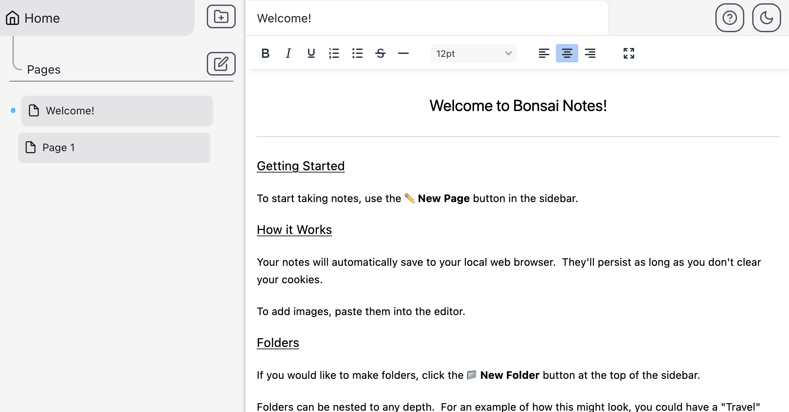
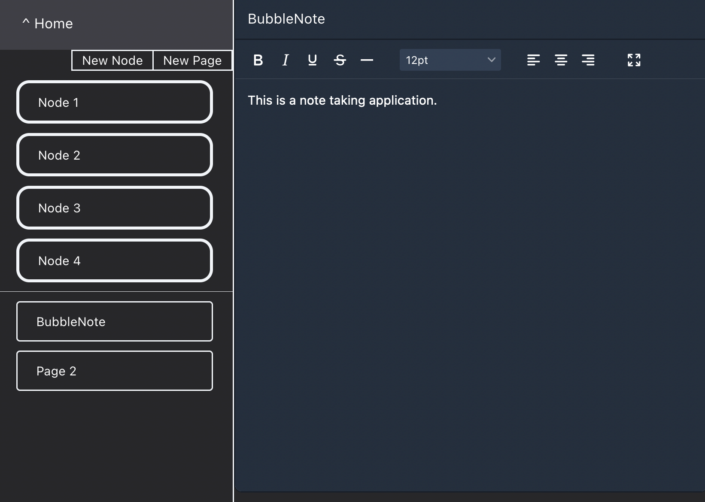

## Bonsai Notes

This is a note taking application, which is a work in progress.  

The main feature is "Nodes".  Nodes can hold pages and/or more Nodes, and they can be nested to any depth.

This is intended to be a maximally easy-to-use and user-friendly note-taking app, wherein you can easily break down your notes into categories and subcategories.

Current features (As of 07/04/22):

- Creation and navigation of Nodes and Pages to any depth.
- Saving of page title and content (until browser refresh).
- Dark theme toggle.

## Dark Theme:

